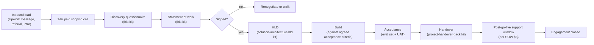
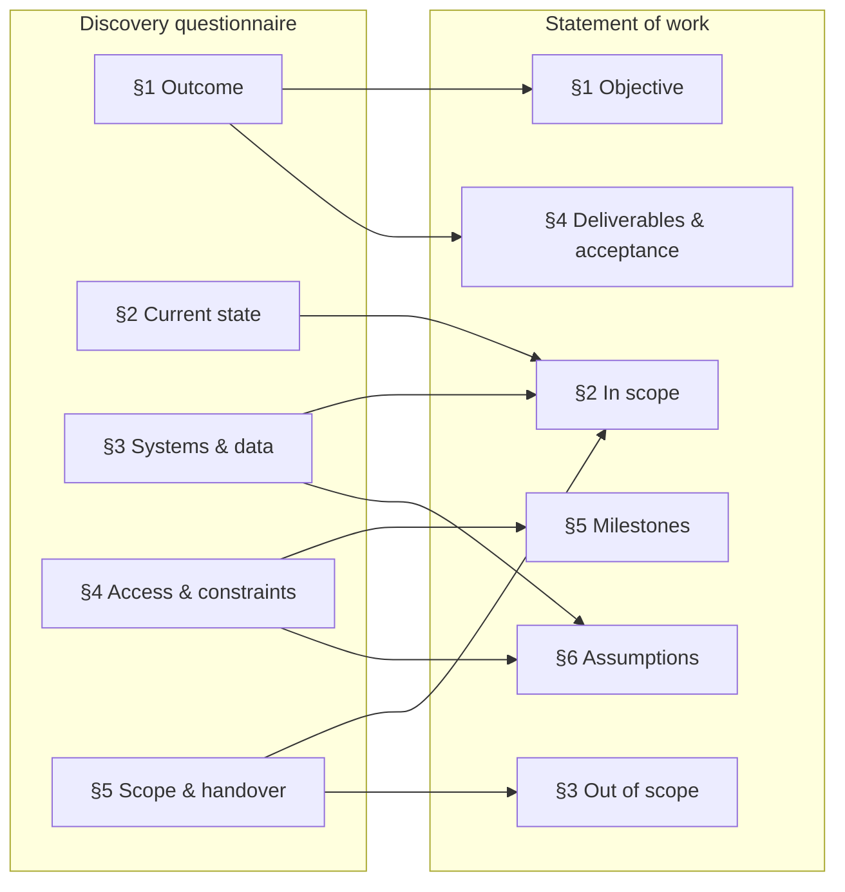
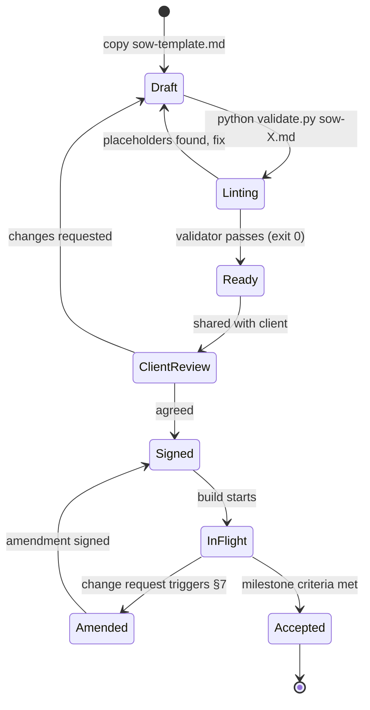
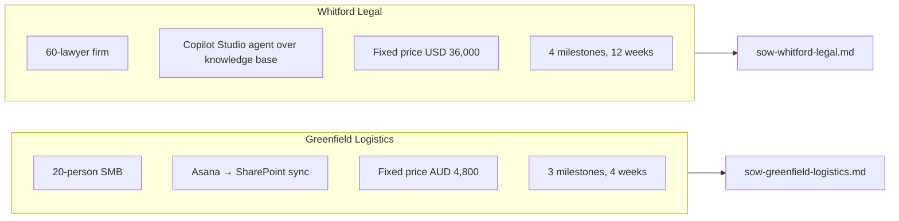

# Diagrams

This is a templates kit, not a runnable system — the diagrams here are
about how the templates fit into an engagement, not about code paths.

## 1. The engagement flow this kit covers (and what comes after)

The discovery + SOW kit covers the first two steps after the scoping
call. The other kits cover later phases — the cross-links keep the
narrative continuous.

## 2. Sections of the questionnaire → sections of the SOW

## 3. SOW lifecycle — version control

The validator gate exists for one reason: leftover `<placeholder>`
markers from the template are the #1 unforced error when sending SOWs
under time pressure. The validator catches them automatically.

## 4. Two worked engagements at a glance

The two worked examples in [`examples/`](../examples/) bracket the
typical SMB / mid-market range. Your engagement will fit somewhere on
that spectrum.
